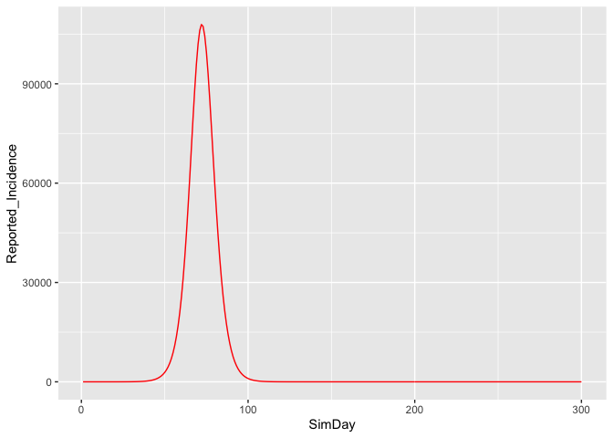

Running a model
================

<!-- README.md is generated from README.Rmd. Please edit that file -->

In order to run a model, the following steps should be taken.

  - First, load in the libraries, and include **ggplot2** for
    visualisation

<!-- end list -->

``` r
library(seirR)
library(ggplot2)
library(dplyr)
library(readsdr)
```

  - Next, call the constructor to create an S3 model object

<!-- end list -->

``` r
mod <- create_seir_p()
```

The **mod** variable has the following S3 structure.

``` r
class(mod) 
```

    ## [1] "seir_p" "seir"   "list"

The **mod** variable has a number of list elements, as follows:

``` r
str(mod) 
```

    ## List of 5
    ##  $ params         :Classes 'tbl_df', 'tbl' and 'data.frame': 36 obs. of  8 variables:
    ##   ..$ ParameterName: chr [1:36] "AT" "Average_HLOS" "Average_Wait_for_Results" "Beta_Calibrated" ...
    ##   ..$ ParameterType: chr [1:36] "Model" "HealthSystem" "HealthSystem" "Transmission" ...
    ##   ..$ Description  : chr [1:36] "Adjustment time for ICU exits" "Average length of stay in hospital (days)" "Average wait for test results (days)" "Estomated effective contact rate (1/day)" ...
    ##   ..$ Value        : num [1:36] 1 15 3.16 0.91 0.11 ...
    ##   ..$ UpperEstimate: num [1:36] 1 15 3.16 0.91 0.11 ...
    ##   ..$ LowerEstimate: num [1:36] 1 15 3.16 0.91 0.11 ...
    ##   ..$ Models       : chr [1:36] "seir_p" "seir_p" "seir_p" "seir_p" ...
    ##   ..$ ValueS       : chr [1:36] NA NA NA NA ...
    ##  $ sim_date       :Classes 'tbl_df', 'tbl' and 'data.frame': 300 obs. of  2 variables:
    ##   ..$ SimTime: int [1:300] 1 2 3 4 5 6 7 8 9 10 ...
    ##   ..$ Date   : Date[1:300], format: "2020-02-29" ...
    ##  $ POLYMOD        :List of 2
    ##   ..$ Symmetric    :List of 3
    ##   .. ..$ matrix      : num [1:5, 1:5] 1.916 0.624 0.3 0.522 0.145 ...
    ##   .. .. ..- attr(*, "dimnames")=List of 2
    ##   .. .. .. ..$                  : chr [1:5] "[0,5)" "[5,15)" "[15,20)" "[20,65)" ...
    ##   .. .. .. ..$ contact.age.group: chr [1:5] "[0,5)" "[5,15)" "[15,20)" "[20,65)" ...
    ##   .. ..$ demography  :Classes 'data.table' and 'data.frame': 5 obs. of  3 variables:
    ##   .. .. ..$ lower.age.limit: num [1:5] 0 5 15 20 65
    ##   .. .. ..$ population     : num [1:5] 351883 700216 316914 2903612 727349
    ##   .. .. ..$ upper.age.limit: num [1:5] 5 15 20 65 80
    ##   .. .. ..- attr(*, ".internal.selfref")=<externalptr> 
    ##   .. .. ..- attr(*, "sorted")= chr "lower.age.limit"
    ##   .. ..$ participants:Classes 'data.table' and 'data.frame': 5 obs. of  3 variables:
    ##   .. .. ..$ age.group   : chr [1:5] "[0,5)" "[5,15)" "[15,20)" "[20,65)" ...
    ##   .. .. ..$ participants: int [1:5] 95 204 105 551 56
    ##   .. .. ..$ proportion  : num [1:5] 0.094 0.2018 0.1039 0.545 0.0554
    ##   .. .. ..- attr(*, ".internal.selfref")=<externalptr> 
    ##   ..$ Non_Symmetric:List of 2
    ##   .. ..$ matrix      : num [1:5, 1:5] 1.916 0.529 0.238 0.441 0.179 ...
    ##   .. .. ..- attr(*, "dimnames")=List of 2
    ##   .. .. .. ..$ age.group        : chr [1:5] "[0,5)" "[5,15)" "[15,20)" "[20,65)" ...
    ##   .. .. .. ..$ contact.age.group: chr [1:5] "[0,5)" "[5,15)" "[15,20)" "[20,65)" ...
    ##   .. ..$ participants:Classes 'data.table' and 'data.frame': 5 obs. of  3 variables:
    ##   .. .. ..$ age.group   : chr [1:5] "[0,5)" "[5,15)" "[15,20)" "[20,65)" ...
    ##   .. .. ..$ participants: int [1:5] 95 204 105 551 56
    ##   .. .. ..$ proportion  : num [1:5] 0.094 0.2018 0.1039 0.545 0.0554
    ##   .. .. ..- attr(*, ".internal.selfref")=<externalptr> 
    ##  $ package_version:Classes 'package_version', 'numeric_version'  hidden list of 1
    ##   ..$ : int [1:2] 0 2
    ##  $ type           : chr "SEIR Population Model"
    ##  - attr(*, "class")= chr [1:3] "seir_p" "seir" "list"

The paramters that drive the model can be viewed using the **summary**
function. Note that there are escape characters in the output in order
that the descriptions are shown in red when used at the console.

``` r
summary(mod) 
```

    ## 
    ## seirR model assumptions
    ## Package seirR Version =  0.2 
    ## Model Class Info =  seir_p seir list 
    ## 
    ## (1) Initial Conditions
    ## ======================
    ## Number_Seeds  =  1    =>  Initial number of infectious people in the population 
    ## Total_Population  =  4999970      =>  Total population (people) 
    ## start_day  =  1   =>  Start day of epidemic, see variable ValueS 
    ## start_day  =  2020-02-29 
    ## end_day  =  300   =>  End day of epidemic, see variable ValueS 
    ## 
    ## (2) Transmission Parameters
    ## ===========================
    ## Beta_Calibrated  =  0.91      =>  Estomated effective contact rate (1/day) 
    ## Beta_Multiplier_h  =  0.11    =>  Effective contact rate multiplier for asymptomatic (dmnl) 
    ## Beta_Multiplier_i  =  0.07    =>  Effective contact rate multiplier for those in isolation (dmnl) 
    ## Beta_Multiplier_j  =  0.0612326   =>  Effective contact rate multiplier for those awaiting results (dmnl) 
    ## Beta_Multiplier_k  =  1   =>  Additional self-quarantine multiplier for asymptomatic (dmnl) 
    ## R0_Fixed_Flag  =  1   =>  Flag (0|1) that will fix R0 for the simulation 
    ## R0_Input  =  3.67     =>  If R0_Fixed_Flag is set to 1, this value of R0 will be used. 
    ## 
    ## (3) Biological Parameters
    ## =========================
    ## Incubation_Period_C  =  5.79      =>  Average incubation period, includes infectious element 
    ## Latent_Period_L  =  3.58      =>  Average latent time (not infectious) 
    ## Total_Infectious_Period_D  =  5.46    =>  Total infectious period for disease (days) 
    ## 
    ## (4) Pathway Flow Parameters
    ## ===========================
    ## Fraction_in_Risk_Group  =  0      =>  Fraction of those hospitalised who are at risk of severe illness 
    ## Proportion_Asymptomatic_f  =  0.25    =>  Proportion of the population who are asymptomatic 
    ## Proportion_Hospitalised  =  0     =>  Proportion of the population who are hospitalised 
    ## Proportion_Quarantined_q  =  0.21     =>  Proportion of the population who are quarantined 
    ## Proportion_Tested_t  =  0.55      =>  Proportion of the population who are tested 
    ## 
    ## (5) Physical Distancing Parameters
    ## ==================================
    ## Distancing_Start_Time  =  20      =>  When physical distancing is started 
    ## Distancing_Switch  =  0   =>  A flag that switches on the physcial distancing policy 
    ## PDAT  =  4    =>  Time lag before distancing measures have an impact (day) 
    ## Percentage_Reduction_of_Physical_Distancing  =  0.6   =>  Percentage reduction in transmission via physical distancing 
    ## 
    ## (6) Health System Parameters
    ## ============================
    ## Average_HLOS  =  15   =>  Average length of stay in hospital (days) 
    ## Average_Wait_for_Results  =  3.16     =>  Average wait for test results (days) 
    ## Fraction_In_Hospital_Severe  =  0     =>  Fraction of those entering hospital who become severely ill (dimn) 
    ## ICU_Available_Capacity  =  250    =>  Available ICU capacity (people) 
    ## ICU_Residency_Time  =  10     =>  Average residencu time in ICU (day) 
    ## 
    ## (7) Pulse Policy Parameters
    ## ===========================
    ## Pulse_Duration  =  21     =>  The duration of the pulse intervention (relaxation of distancing) 
    ## Pulse_End  =  300     =>  End of pulse policy 
    ## Pulse_Off_Duration  =  10     =>  Duration of time in between pulses 
    ## Pulse_Switch  =  0    =>  Activate/deactive the pulse policy 
    ## Switch_Time  =  200   =>  The time to switch to the pulse policy 
    ## 
    ## (8) Additional Model Parameters
    ## ===============================
    ## AT  =  1      =>  Adjustment time for ICU exits 
    ## Lag_Time  =  1    =>  Amount of time to make ICU space available (day) 
    ## RTime_Severe  =  1    =>  Time before developing severe symptoms

  - A model can then be run based on the **mod** object by calling the
    function **run()** In this example, we run the model twice, and
    alter a parmeter using the **set\_params()** function

<!-- end list -->

``` r
mod <- create_seir_p()
out1 <- run(mod)
ggplot()+geom_line(out1,mapping=aes(x=SimDay,y=Reported_Incidence),colour="red")
```

<!-- -->

The output from these models is a tibble, containing a good deal of
simulation information.

``` r
glimpse(out1)
```

    ## Observations: 300
    ## Variables: 157
    ## $ Date                                                 <date> 2020-02-29…
    ## $ SimDay                                               <dbl> 1, 2, 3, 4,…
    ## $ Country                                              <chr> "Ireland", …
    ## $ ReportedNewCases                                     <dbl> 0, 1, 0, NA…
    ## $ ReportedNewDeaths                                    <dbl> 0, 0, 0, NA…
    ## $ ReportedTotalCases                                   <dbl> 0, 1, 1, NA…
    ## $ ReportedTotalDeaths                                  <dbl> 0, 0, 0, NA…
    ## $ Asymptomatic_Infected_01                             <dbl> 0.00000000,…
    ## $ Asymptomatic_Infected_02                             <dbl> 0.000000000…
    ## $ Awaiting_Results_01                                  <dbl> 0.00000000,…
    ## $ Awaiting_Results_02                                  <dbl> 0.00000000,…
    ## $ Cumulative_Immediate_Isolation                       <dbl> 0.00000000,…
    ## $ Cumulative_Infectious_Asymptomatic                   <dbl> 0.00000000,…
    ## $ Cumulative_Model_Infected                            <dbl> 0.0000000, …
    ## $ Cumulative_Not_Quarantined                           <dbl> 0.00000000,…
    ## $ Cumulative_Test_Incidence                            <dbl> 0.000000000…
    ## $ Cumulative_Tests_Positive                            <dbl> 0.00000000,…
    ## $ Expected_ICU_Exits                                   <dbl> 0, 0, 0, 0,…
    ## $ Exposed_01                                           <dbl> 0.0000000, …
    ## $ Exposed_02                                           <dbl> 0.0000000, …
    ## $ In_Hospital_01                                       <dbl> 0, 0, 0, 0,…
    ## $ In_Hospital_02                                       <dbl> 0, 0, 0, 0,…
    ## $ In_Hospital_03                                       <dbl> 0, 0, 0, 0,…
    ## $ In_Hospital_Severe                                   <dbl> 0, 0, 0, 0,…
    ## $ Infected_Presymptomatic_01                           <dbl> 1.0000000, …
    ## $ Infected_Presymptomatic_02                           <dbl> 0.0000000, …
    ## $ Not_Quarantine_Infectious_01                         <dbl> 0.00000000,…
    ## $ Not_Quarantine_Infectious_02                         <dbl> 0.000000000…
    ## $ Physical_Distancing_Smoothed_Value                   <dbl> 1, 1, 1, 1,…
    ## $ Removed_Asymptomatic                                 <dbl> 0.000000e+0…
    ## $ Removed_Awaiting_Results                             <dbl> 0.000000000…
    ## $ Removed_Hospital                                     <dbl> 0, 0, 0, 0,…
    ## $ Removed_Not_Quarantine                               <dbl> 0.000000e+0…
    ## $ Removed_Severe_Cases_Hospital                        <dbl> 0, 0, 0, 0,…
    ## $ Removed_Severe_Cases_ICU                             <dbl> 0, 0, 0, 0,…
    ## $ Removed_Symptomatic_Immediate_Isolation              <dbl> 0.000000e+0…
    ## $ Severe_Cases_Hospital_01                             <dbl> 0, 0, 0, 0,…
    ## $ Severe_Cases_Hospital_02                             <dbl> 0, 0, 0, 0,…
    ## $ Severe_Cases_ICU_01                                  <dbl> 0, 0, 0, 0,…
    ## $ Severe_Cases_ICU_02                                  <dbl> 0, 0, 0, 0,…
    ## $ Susceptible                                          <dbl> 4999969, 49…
    ## $ Symptomatic_Immediate_Isolation_01                   <dbl> 0.00000000,…
    ## $ Symptomatic_Immediate_Isolation_02                   <dbl> 0.00000000,…
    ## $ AR1                                                  <dbl> 0.00000000,…
    ## $ Asymptomatic_Infectious_Period                       <dbl> 2.21, 2.21,…
    ## $ Beta_Pulse_Reduction_Factor                          <dbl> 1, 1, 1, 1,…
    ## $ C01_Total_Infected_Presymptomatic                    <dbl> 1.0000000, …
    ## $ C02_Total_Asymptomatic_Infected                      <dbl> 0.00000000,…
    ## $ C03_Total_Symptomatic_Immediate_Isolation_Infectious <dbl> 0.00000000,…
    ## $ C04_Total_Awaiting_Results_Infectious                <dbl> 0.00000000,…
    ## $ C05_Total_Isolated_After_Test_Infected               <dbl> 0.00000000,…
    ## $ C06_Total_Not_Quarantining_Infected                  <dbl> 0.00000000,…
    ## $ Checksum_Cumulative_Flows                            <dbl> 0.0000000, …
    ## $ E01                                                  <dbl> 0.0000000, …
    ## $ E02                                                  <dbl> 0.00000000,…
    ## $ EXH02                                                <dbl> 0, 0, 0, 0,…
    ## $ EXH03                                                <dbl> 0, 0, 0, 0,…
    ## $ ICTI                                                 <dbl> 0.00000000,…
    ## $ ICU_Daily_Freed_Up_Space                             <dbl> 0, 0, 0, 0,…
    ## $ ICU01                                                <dbl> 0, 0, 0, 0,…
    ## $ ICU02                                                <dbl> 0, 0, 0, 0,…
    ## $ IP01                                                 <dbl> 0.9049774, …
    ## $ Net_Infectious_Period_for_Infection_Compartments     <dbl> 3.25, 3.25,…
    ## $ NQI1                                                 <dbl> 0.00000000,…
    ## $ NQI2                                                 <dbl> 0.000000000…
    ## $ Numerator_Term_1                                     <dbl> 0.8154347, …
    ## $ Numerator_Term_2                                     <dbl> 2.079487, 2…
    ## $ Numerator_Term_3                                     <dbl> 1.331058, 1…
    ## $ Pulse_Repeat                                         <dbl> 31, 31, 31,…
    ## $ Reported_Incidence                                   <dbl> 0.00000000,…
    ## $ SCH01                                                <dbl> 0, 0, 0, 0,…
    ## $ SCH02                                                <dbl> 0, 0, 0, 0,…
    ## $ SII01                                                <dbl> 0.00000000,…
    ## $ SII02                                                <dbl> 0.000000000…
    ## $ Test                                                 <dbl> 0, 0, 0, 0,…
    ## $ Total_Exiting_AR02                                   <dbl> 0.00000000,…
    ## $ Total_Exiting_Hospital_01                            <dbl> 0, 0, 0, 0,…
    ## $ Total_Exiting_Hospital_Severe                        <dbl> 0, 0, 0, 0,…
    ## $ Total_Exiting_IP02                                   <dbl> 0.0000000, …
    ## $ Total_Exposed                                        <dbl> 0.0000000, …
    ## $ Total_Hospitalised                                   <dbl> 0, 0, 0, 0,…
    ## $ Total_in_Hospital_Non_Severe                         <dbl> 0, 0, 0, 0,…
    ## $ Total_Infectious                                     <dbl> 1.000000, 1…
    ## $ Total_Removed                                        <dbl> 0.000000000…
    ## $ Total_Severe_in_ICU                                  <dbl> 0, 0, 0, 0,…
    ## $ Total_Severe_in_NonICU_Hospital                      <dbl> 0, 0, 0, 0,…
    ## $ Additional_ICU_Places_Required                       <dbl> 0, 0, 0, 0,…
    ## $ ASI1                                                 <dbl> 0.00000000,…
    ## $ ASI2                                                 <dbl> 0.000000000…
    ## $ Beta_From_Input_R0                                   <dbl> 0.8684377, …
    ## $ Beta_Intermediate                                    <dbl> 0.8684377, …
    ## $ EntHos                                               <dbl> 0, 0, 0, 0,…
    ## $ EntRem                                               <dbl> 0.00000000,…
    ## $ Error_Delta                                          <dbl> 0, 0, 0, 0,…
    ## $ EXH01a                                               <dbl> 0, 0, 0, 0,…
    ## $ EXH01b                                               <dbl> 0, 0, 0, 0,…
    ## $ ICU_Available_Space                                  <dbl> 250, 250, 2…
    ## $ IHS01                                                <dbl> 0, 0, 0, 0,…
    ## $ IHS02                                                <dbl> 0, 0, 0, 0,…
    ## $ IP02a                                                <dbl> 0.00000000,…
    ## $ IP02b                                                <dbl> 0.00000000,…
    ## $ IP02c                                                <dbl> 0.0000000, …
    ## $ IP02d                                                <dbl> 0.00000000,…
    ## $ Population_Attack_Rate                               <dbl> 0.000000e+0…
    ## $ Pulse_Policy                                         <dbl> 0, 0, 0, 0,…
    ## $ Total_in_Hospital                                    <dbl> 0, 0, 0, 0,…
    ## $ Total_Severe_in_Hospital                             <dbl> 0, 0, 0, 0,…
    ## $ Beta                                                 <dbl> 0.8684377, …
    ## $ CEICUE                                               <dbl> 0, 0, 0, 0,…
    ## $ CheckSum_Population                                  <dbl> 4999970, 49…
    ## $ ICIA                                                 <dbl> 0.00000000,…
    ## $ ICII                                                 <dbl> 0.00000000,…
    ## $ ICNQ                                                 <dbl> 0.00000000,…
    ## $ ICTP                                                 <dbl> 0.0000000, …
    ## $ IP02_Outflow_Total_Exiting_Checksum                  <dbl> 0.0000000, …
    ## $ Lambda                                               <dbl> 1.736886e-0…
    ## $ Physical_Distancing_Fractional_Reduction_Amount      <dbl> 1, 1, 1, 1,…
    ## $ R0                                                   <dbl> 3.67, 3.67,…
    ## $ IR                                                   <dbl> 0.8684375, …
    ## $ PDSVG                                                <dbl> 0, 0, 0, 0,…
    ## $ CPDSV                                                <dbl> 0, 0, 0, 0,…
    ## $ ICI                                                  <dbl> 0.8684375, …
    ## $ Week                                                 <dbl> 9, 9, 9, 9,…
    ## $ AT                                                   <dbl> 1, 1, 1, 1,…
    ## $ Average_HLOS                                         <dbl> 15, 15, 15,…
    ## $ Average_Wait_for_Results                             <dbl> 3.16, 3.16,…
    ## $ Beta_Calibrated                                      <dbl> 0.91, 0.91,…
    ## $ Beta_Multiplier_h                                    <dbl> 0.11, 0.11,…
    ## $ Beta_Multiplier_i                                    <dbl> 0.07, 0.07,…
    ## $ Beta_Multiplier_j                                    <dbl> 0.0612326, …
    ## $ Beta_Multiplier_k                                    <dbl> 1, 1, 1, 1,…
    ## $ Distancing_Start_Time                                <dbl> 20, 20, 20,…
    ## $ Distancing_Switch                                    <dbl> 0, 0, 0, 0,…
    ## $ Fraction_In_Hospital_Severe                          <dbl> 0, 0, 0, 0,…
    ## $ Fraction_in_Risk_Group                               <dbl> 0, 0, 0, 0,…
    ## $ ICU_Available_Capacity                               <dbl> 250, 250, 2…
    ## $ ICU_Residency_Time                                   <dbl> 10, 10, 10,…
    ## $ Incubation_Period_C                                  <dbl> 5.79, 5.79,…
    ## $ Lag_Time                                             <dbl> 1, 1, 1, 1,…
    ## $ Latent_Period_L                                      <dbl> 3.58, 3.58,…
    ## $ Number_Seeds                                         <dbl> 1, 1, 1, 1,…
    ## $ PDAT                                                 <dbl> 4, 4, 4, 4,…
    ## $ Percentage_Reduction_of_Physical_Distancing          <dbl> 0.6, 0.6, 0…
    ## $ Proportion_Asymptomatic_f                            <dbl> 0.25, 0.25,…
    ## $ Proportion_Hospitalised                              <dbl> 0, 0, 0, 0,…
    ## $ Proportion_Quarantined_q                             <dbl> 0.21, 0.21,…
    ## $ Proportion_Tested_t                                  <dbl> 0.55, 0.55,…
    ## $ Pulse_Duration                                       <dbl> 21, 21, 21,…
    ## $ Pulse_End                                            <dbl> 300, 300, 3…
    ## $ Pulse_Off_Duration                                   <dbl> 10, 10, 10,…
    ## $ Pulse_Switch                                         <dbl> 0, 0, 0, 0,…
    ## $ R0_Fixed_Flag                                        <dbl> 1, 1, 1, 1,…
    ## $ R0_Input                                             <dbl> 3.67, 3.67,…
    ## $ RTime_Severe                                         <dbl> 1, 1, 1, 1,…
    ## $ Switch_Time                                          <dbl> 200, 200, 2…
    ## $ Total_Infectious_Period_D                            <dbl> 5.46, 5.46,…
    ## $ Total_Population                                     <dbl> 4999970, 49…

The behaviour modes of variables can be explored by calling the function
**get\_curve\_analysis()**. The descriptors here include:

  - INC-INC (increasing at an increasing rate)
  - INC-DEC (increating at a decreasing rate)
  - DEC-INC (decreasing at an increasing rate)
  - DEC-DEC (decreasing at a decreasing rate)

<!-- end list -->

``` r
vars <- c("Reported_Incidence")

ca <- get_curve_analysis(out1,vars)

ggplot(ca,aes(x=SimDay,y=Value,colour=Behaviour))+geom_point()+facet_grid(Variable~.)
```

<!-- -->
