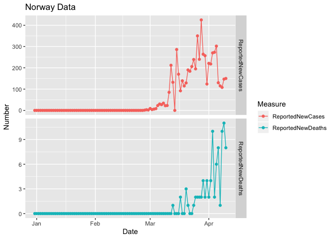

Exploring available data
================

<!-- README.md is generated from README.Rmd. Please edit that file -->

The package downloads up-to-date COVID-19 numbers from the
<https://covid.ourworldindata.org/data/ecdc/full_data.csv>.

This data is stored in the **date\_env** environment, and can be
accessed. The following is the process for doing this

  - First, load in the libraries, and include **ggplot2** for
    visualisation, and **dplyr** and **tidyr** for data manipulation.

<!-- end list -->

``` r
library(seirR)
library(ggplot2)
library(dplyr)
library(tidyr)
```

  - Explore the data contained in the R environment data\_env

<!-- end list -->

``` r
data_env$covid_data
```

    ## # A tibble: 10,024 x 6
    ##    Date       Country ReportedNewCases ReportedNewDeat… ReportedTotalCa…
    ##    <date>     <chr>              <dbl>            <dbl>            <dbl>
    ##  1 2019-12-31 Afghan…                0                0                0
    ##  2 2020-01-01 Afghan…                0                0                0
    ##  3 2020-01-02 Afghan…                0                0                0
    ##  4 2020-01-03 Afghan…                0                0                0
    ##  5 2020-01-04 Afghan…                0                0                0
    ##  6 2020-01-05 Afghan…                0                0                0
    ##  7 2020-01-06 Afghan…                0                0                0
    ##  8 2020-01-07 Afghan…                0                0                0
    ##  9 2020-01-08 Afghan…                0                0                0
    ## 10 2020-01-09 Afghan…                0                0                0
    ## # … with 10,014 more rows, and 1 more variable: ReportedTotalDeaths <dbl>

  - Filter out a country of interest, and reshape to tidy data format

<!-- end list -->

``` r
countries <- c("Norway")

ds <- filter(data_env$covid_data,
             Country %in% countries)

ds_piv <- ds %>% pivot_longer(-c(Date,Country),names_to ="Measure",values_to = "Number") %>%
   filter(Measure %in% c("ReportedNewCases","ReportedNewDeaths"))
```

  - Explore the re-shaped dataset

<!-- end list -->

``` r
ds_piv
```

    ## # A tibble: 204 x 4
    ##    Date       Country Measure           Number
    ##    <date>     <chr>   <chr>              <dbl>
    ##  1 2019-12-31 Norway  ReportedNewCases       0
    ##  2 2019-12-31 Norway  ReportedNewDeaths      0
    ##  3 2020-01-01 Norway  ReportedNewCases       0
    ##  4 2020-01-01 Norway  ReportedNewDeaths      0
    ##  5 2020-01-02 Norway  ReportedNewCases       0
    ##  6 2020-01-02 Norway  ReportedNewDeaths      0
    ##  7 2020-01-03 Norway  ReportedNewCases       0
    ##  8 2020-01-03 Norway  ReportedNewDeaths      0
    ##  9 2020-01-04 Norway  ReportedNewCases       0
    ## 10 2020-01-04 Norway  ReportedNewDeaths      0
    ## # … with 194 more rows

  - Visualise some of the results

<!-- end list -->

``` r
ggplot(ds_piv,aes(x=Date,y=Number,colour=Measure))+
  facet_grid(Measure~.,scales = "free_y")+
  geom_point()+geom_line()+ggtitle("Norway Data")
```

<!-- -->
