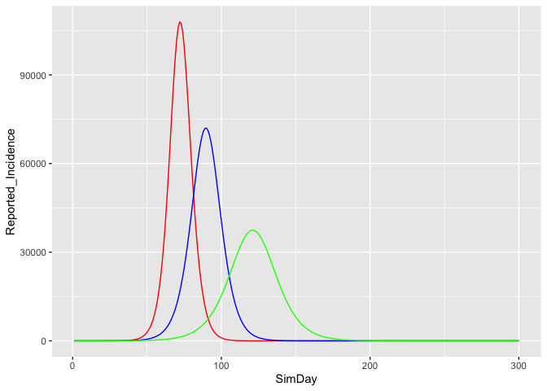

Exploring Scenarios
================

<!-- README.md is generated from README.Rmd. Please edit that file -->

A number of runs can be executed and compared.

  - First, load in the libraries.

<!-- end list -->

``` r
library(seirR)
library(ggplot2)
library(readsdr)
```

  - Create the model, run it once (unmitigated) and store in **out1**

<!-- end list -->

``` r
mod <- create_seir_p()

out1 <- run(mod)
```

  - Run the model with physical distancing set to a 30% reduction.

<!-- end list -->

``` r
mod <- set_param(mod,"Distancing_Switch",1)
mod <- set_param(mod,"Switch_Time",300) # time to end continuous physcial distancing
mod <- set_param(mod,"Percentage_Reduction_of_Physical_Distancing",.3)
out2 <- run(mod)
```

  - Run the model for a third time with physical distancing set to a 50%
    reduction.

<!-- end list -->

``` r
mod <- set_param(mod,"Percentage_Reduction_of_Physical_Distancing",.5)
out3 <- run(mod)
```

  - Display the
results

<!-- end list -->

``` r
ggplot()+geom_line(out1,mapping=aes(x=SimDay,y=Reported_Incidence),colour="red")+
  geom_line(out2,mapping=aes(x=SimDay,y=Reported_Incidence),colour="blue")+
  geom_line(out3,mapping=aes(x=SimDay,y=Reported_Incidence),colour="green")
```

<!-- -->
