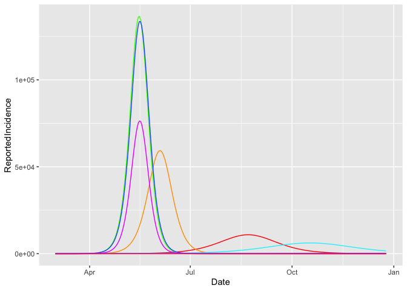

Sensitivity runs
================

<!-- README.md is generated from README.Rmd. Please edit that file -->

The model can be run a number of times to support sensitivity analysis.
Here, the package **purrr** is used to generate a large output data set
(which is essentially a collation of all the individual runs, with a new
ID added to the table so that the primary key is {RunNumber, SimDay})

  - First, load in the
    libraries.

<!-- end list -->

``` r
library(seirR)
```

    ## Welcome to package seirR v0.0.0.1

    ## Checking https://covid.ourworldindata.org/data/ecdc/full_data.csv  for data update...

    ## Loading https://covid.ourworldindata.org/data/ecdc/full_data.csv  to global environment data_env

``` r
library(ggplot2)
library(purrr)
library(dplyr)
```

    ## 
    ## Attaching package: 'dplyr'

    ## The following object is masked from 'package:seirR':
    ## 
    ##     explain

    ## The following objects are masked from 'package:stats':
    ## 
    ##     filter, lag

    ## The following objects are masked from 'package:base':
    ## 
    ##     intersect, setdiff, setequal, union

  - Create the model, and set the physical distancing option

<!-- end list -->

``` r
mod <- create_seir_p()
mod <- set_param(mod,"distancing_flag",1)
```

  - Set the sensitivity parameter ranges, and the number of runs.
    Packages such as FME can be used for this, as it supports a wider
    range of random number generations.
    <https://cran.r-project.org/web/packages/FME/index.html>

<!-- end list -->

``` r
NRUNS <- 10

lower <- 0.2
upper <- 0.8
percentages    <- runif(NRUNS,.1,.9)
f_asymptomatic <- runif(NRUNS,.15,.7)
```

  - Write a script to run the model a number of times, sampling from the
    random number streams

<!-- end list -->

``` r
res_full <- map_df(1:NRUNS, function(i){
  cat("iteration = ", i, "with percentage = ", percentages[i], " and f = ",f_asymptomatic[i],"\n")
  mod <- set_param(mod,"pd_percentage_reduction",percentages[i])
  mod <- set_param(mod,"prop_asymptomatic",f_asymptomatic[i])
  out2 <- run(mod) %>% mutate(RunNumber=i) %>%
     select(RunNumber,everything())
})
```

    ## iteration =  1 with percentage =  0.5475142  and f =  0.6476609 
    ## iteration =  2 with percentage =  0.3642019  and f =  0.5198257 
    ## iteration =  3 with percentage =  0.7078094  and f =  0.4796776 
    ## iteration =  4 with percentage =  0.2770122  and f =  0.2674452 
    ## iteration =  5 with percentage =  0.8192057  and f =  0.2859403 
    ## iteration =  6 with percentage =  0.6060648  and f =  0.5831134 
    ## iteration =  7 with percentage =  0.2861077  and f =  0.2689446 
    ## iteration =  8 with percentage =  0.6975361  and f =  0.401058 
    ## iteration =  9 with percentage =  0.1347621  and f =  0.6087271 
    ## iteration =  10 with percentage =  0.7293567  and f =  0.4066658

  - Show all the results for one of the
variables

<!-- end list -->

``` r
ggplot(res_full,aes(x=Date,y=ReportedIncidence,colour=RunNumber,group=RunNumber))+geom_path()+
       scale_colour_gradientn(colours=rainbow(12))+guides(color=FALSE)
```

<!-- -->
