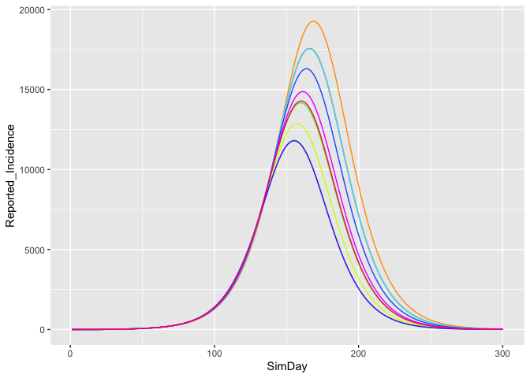
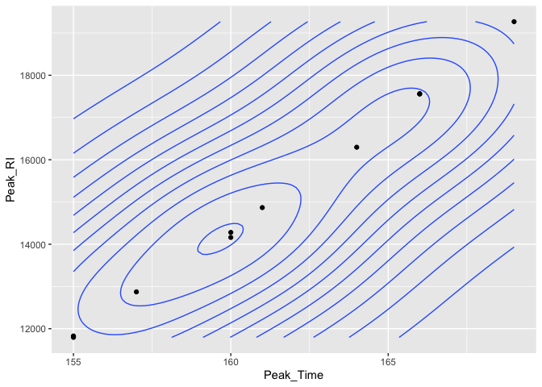

Sensitivity Analysis
================

<!-- README.md is generated from README.Rmd. Please edit that file -->

Sensitivity analysis runs can be performed.

  - First, packages are loaded including **purrr**, **dplyr** and
    **ggplot2**

<!-- end list -->

``` r
library(seirR)
library(ggplot2)
library(purrr)
library(dplyr)
library(readsdr)
```

  - Next, the model is created with the distancing on, and to be
    continued until time 300.

<!-- end list -->

``` r
mod <- create_seir_p()
mod <- set_param(mod,"Distancing_Switch",1)
mod <- set_param(mod,"Switch_Time",300) # time to end continuous physcial distancing
```

  - Setup for 20 runs, varying two parameters.

<!-- end list -->

``` r
NRUNS <- 10

lower <- 0.2
upper <- 0.8
percentages    <- runif(NRUNS,.1,.9)
f_asymptomatic <- runif(NRUNS,.15,.7)
```

  - Use purrr function **map\_df()** to control the sensitivity process

<!-- end list -->

``` r
res_full <- map_df(1:NRUNS, function(i){
  cat("iteration = ", i, "with percentage = ", percentages[i], " and f = ",f_asymptomatic[i],"\n")
  mod <- set_param(mod,"Percentage_Reduction_of_Physical_Disancing",percentages[i])
  mod <- set_param(mod,"Proportion_Asymptomatic_f",f_asymptomatic[i])
  out2 <- run(mod) %>% mutate(RunNumber=i) %>%
     select(RunNumber,everything())
})
```

    ## iteration =  1 with percentage =  0.1800822  and f =  0.248202 
    ## iteration =  2 with percentage =  0.1472724  and f =  0.1672901 
    ## iteration =  3 with percentage =  0.3027557  and f =  0.4657711 
    ## iteration =  4 with percentage =  0.3837302  and f =  0.4069199 
    ## iteration =  5 with percentage =  0.5271513  and f =  0.5130756 
    ## iteration =  6 with percentage =  0.8873302  and f =  0.2486721 
    ## iteration =  7 with percentage =  0.4486229  and f =  0.3077895 
    ## iteration =  8 with percentage =  0.4827502  and f =  0.5145733 
    ## iteration =  9 with percentage =  0.1911256  and f =  0.3742759 
    ## iteration =  10 with percentage =  0.7450129  and f =  0.4014261

  - Display the
results

<!-- end list -->

``` r
ggplot(res_full,aes(x=SimDay,y=Reported_Incidence,colour=RunNumber,group=RunNumber))+geom_path()+
       scale_colour_gradientn(colours=rainbow(12))+guides(color=FALSE)
```

<!-- -->

  - Sample analysis (thanks to Chris Brunsdon (NUIM) for the code)

<!-- end list -->

``` r
res_peaking <- res_full %>%
  group_by(RunNumber) %>%
  summarise(Peak_RI=max(Reported_Incidence),
            Peak_Time=which.max(Reported_Incidence))
```

  - Plot the results

<!-- end list -->

``` r
ggplot(res_peaking %>% filter(Peak_RI>400),
       aes(x=Peak_Time,y=Peak_RI)) +
  geom_point() + geom_density_2d()
```

<!-- -->
