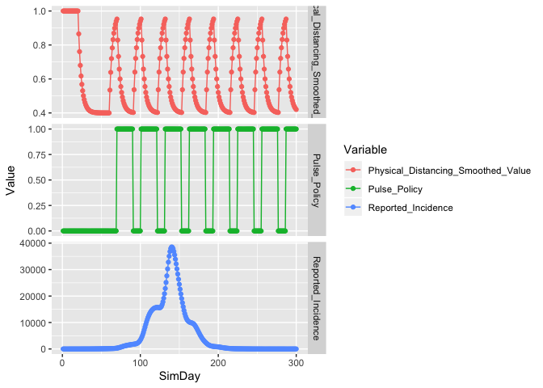
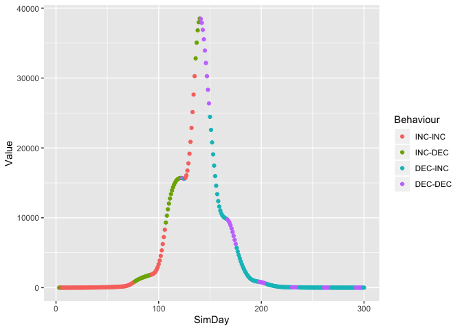

Exploring Pulse Interventions
================

<!-- README.md is generated from README.Rmd. Please edit that file -->

Pulse interventions can also be explored

  - First, load in the libraries.

<!-- end list -->

``` r
library(seirR)
library(ggplot2)
library(readsdr)
library(tidyr)
library(dplyr)
```

  - Create the model, and setup the pulse intervention variable

<!-- end list -->

``` r
mod <- create_seir_p()

mod <- set_param(mod,"Distancing_Switch",1)
mod <- set_param(mod,"Pulse_Switch",1)
mod <- set_param(mod,"Switch_Time",60) # time to switch to Pulse strategy
mod <- set_param(mod,"Percentage_Reduction_of_Physical_Distancing",.6)
```

  - Run the model and extract 3 variables of interest

<!-- end list -->

``` r
out1 <- run(mod)

tb <- out1 %>% select(SimDay,Reported_Incidence,
                      Physical_Distancing_Smoothed_Value,Pulse_Policy) %>%
               pivot_longer(-SimDay,names_to="Variable", values_to = "Value")
```

  - Display the results

<!-- end list -->

``` r
ggplot(tb,aes(x=SimDay,y=Value,colour=Variable))+
  facet_grid(Variable~.,scales = "free_y")+
  geom_point()+geom_line()
```

<!-- -->

  - Analyse the curve for evidence of distancing

<!-- end list -->

``` r
vars <- c("Reported_Incidence")

ca <- get_curve_analysis(out1,vars)

ggplot(ca,aes(x=SimDay,y=Value,colour=Behaviour))+geom_point()
```

<!-- -->
